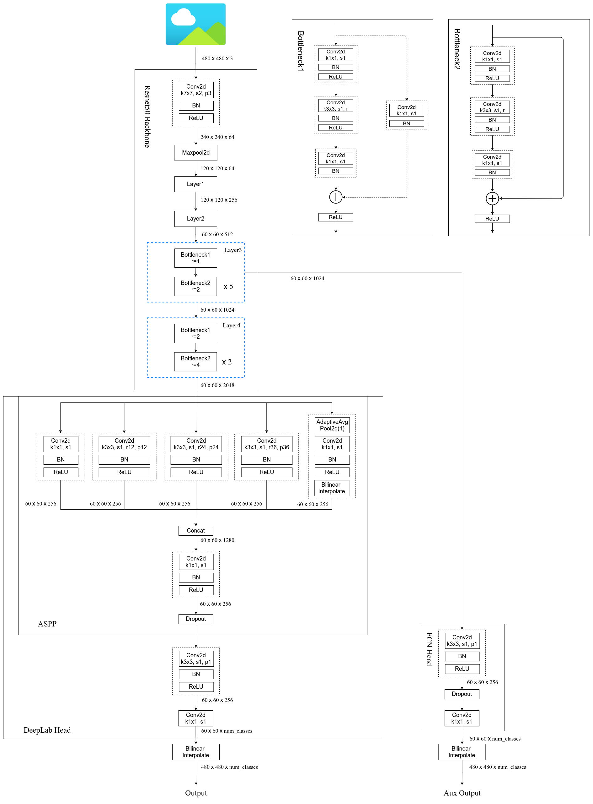

# DeepLabV3(Rethinking Atrous Convolution for Semantic Image Segmentation)


* https://github.com/pytorch/vision/tree/main/torchvision/models/segmentation


* Python3.6/3.7/3.8
* Pytorch1.10


```
  ├── src: 模型的backbone以及DeepLabv3的搭建
  ├── train_utils: 训练、验证以及多GPU训练相关模块
  ├── my_dataset.py: 自定义dataset用于读取VOC数据集
  ├── train.py: 以deeplabv3_resnet50为例进行训练
  ├── train_multi_GPU.py: 针对使用多GPU的用户使用
  ├── predict.py: 简易的预测脚本，使用训练好的权重进行预测测试
  ├── validation.py: 利用训练好的权重验证/测试数据的mIoU等指标，并生成record_mAP.txt文件
  └── pascal_voc_classes.json: pascal_voc标签文件
```


 


## 进一步了解该项目，以及对DeepLabV3代码的分析可参考我的bilibili
* https://www.bilibili.com/video/BV1TD4y1c7Wx

## Pytorch官方实现的DeeplabV3网络框架图

